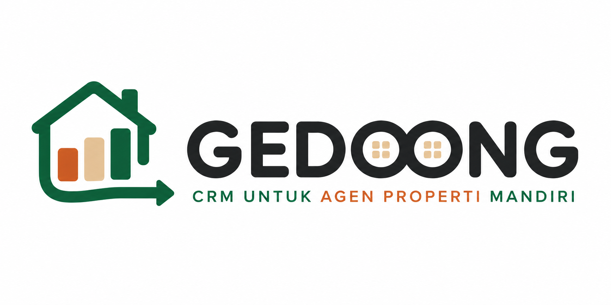
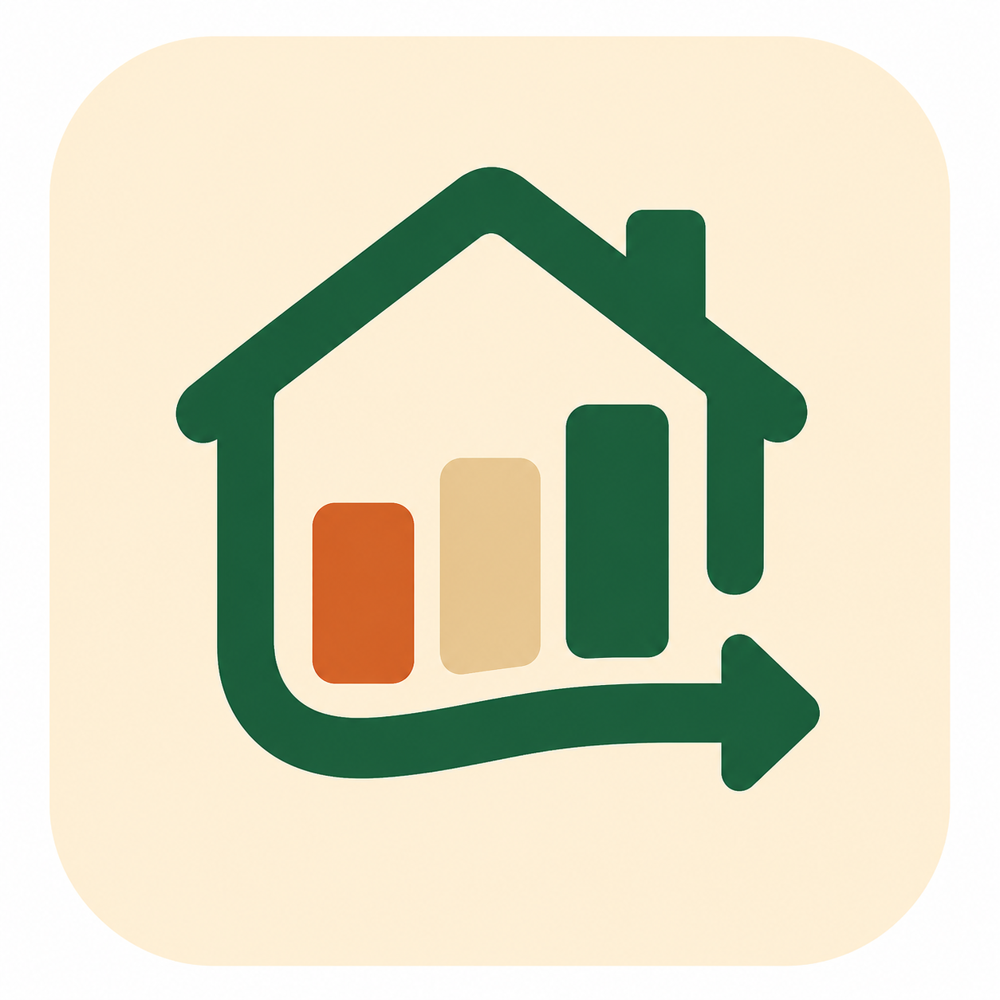

<div align="center">
  
</div>

<br>

<div align="center">
  
</div>

# Gedoong

CRM for independent property agents in Indonesia. Listing management, client pipeline, commission tracking — lightweight tools to replace WhatsApp + spreadsheets.

[](https://go.dev/)
[](https://nuxt.com/)
[](https://flutter.dev/)
[](https://www.mysql.com/)
[](LICENSE)
[](.)

---

## Why Gedoong?

Tens of thousands of independent property agents in Indonesia still rely on WhatsApp and spreadsheets to manage listings, clients, and commissions. Existing CRMs are either too generic or too expensive.

Gedoong is purpose-built for the property agent workflow: from client follow-ups to commission tracking, in a single lightweight tool.

---

## Model

Gedoong follows an **open-core** model — the core codebase is always open source under the MIT license. Premium features are available for advanced needs.

[Read the open-source strategy](docs/OPEN_SOURCE_STRATEGY.md)

---

## Monorepo Structure

```
gedoong/
├── backend/          # Go — REST API
├── frontend/         # Nuxt — web dashboard
├── mobile/           # Flutter — iOS & Android
└── docs/             # Documentation
```

| Layer | Tech |
|---|---|
| Backend | Go |
| Frontend | Nuxt |
| Mobile | Flutter |
| Database | MySQL |
| Caching | Redis |

---

## Features

- **Listing Management** — CRUD for property listings, active/sold/off-market statuses
- **Client Pipeline** — Kanban deal tracker from prospect to closing
- **Commission Tracking** — Calculation and disbursement status
- **Notifications** — In-app + push follow-up reminders

---

## Getting Started

> Project is in the planning phase. Code not yet available.

```bash
git clone https://github.com/faisalaffan/gedoong.git
cd gedoong

# Backend
cd backend && go run ./cmd/server

# Frontend
cd frontend && npm run dev

# Mobile
cd mobile && flutter run
```

### Supabase Social Authentication Setup
To configure **Google Sign-In** and **Apple Sign-In** with Supabase for local development and production, refer to our detailed [Supabase OAuth Setup Guide](docs/SUPABASE_OAUTH_SETUP.md).

You can also run our interactive setup CLI tool to configure it automatically:
```bash
make setup-oauth
```

---

## License

Core codebase: [MIT](LICENSE). Documentation: [CC BY 4.0](https://creativecommons.org/licenses/by/4.0/).

See [Open Source Strategy](docs/OPEN_SOURCE_STRATEGY.md) for license boundary details.
